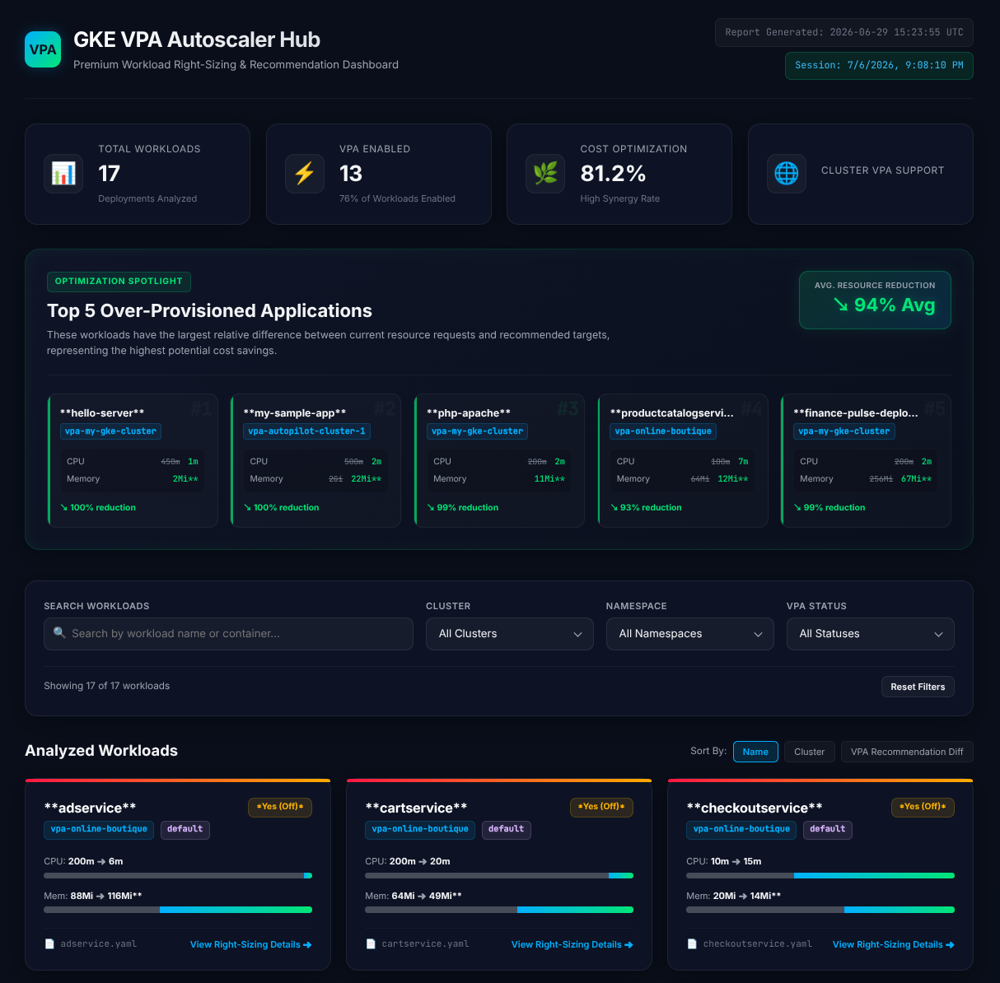
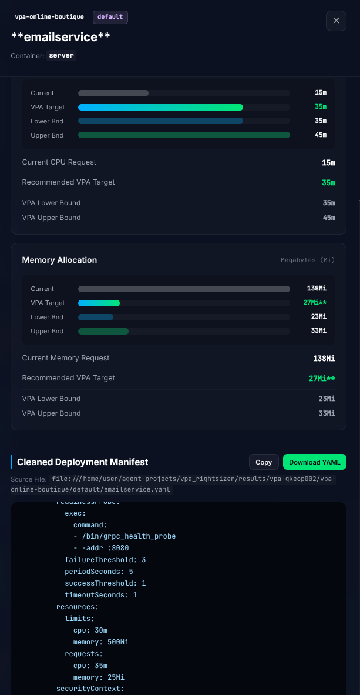

# 📊 GKE VPA Rightsizer Agent

An intelligent single-agent orchestrator built with the **Google Agent Development Kit (ADK)**. It automates GKE cluster resource analysis, queries Vertical Pod Autoscaler (VPA) metrics, generates **newly optimized Kubernetes deployment manifests with updated CPU and memory requests**, compiles an interactive web dashboard, and deploys it directly to either Google Cloud Run or GKE.



---

## 🚀 Key Features

* **Intelligent Single-Agent Orchestration**: Uses a sequential, single-agent tool pipeline to handle automated workflows cleanly without subagent complexity.
* **Intelligent GKE Scraping (`run_project_vpa_scan`)**:
  * Scans multiple GKE clusters dynamically across Google Cloud project(s).
  * Extracts active Vertical Pod Autoscaler (VPA) targets, lower bounds, and upper bounds.
  * Dynamically queries **Cloud Monitoring fallback metrics** for workloads missing VPA definitions.
  * Prompts for missing Project IDs on the fly using the built-in `request_input` tool.
* **Optimized Manifest Generation**: Automatically outputs **new deployment manifest files** with updated container `resources.requests.cpu` and `resources.requests.memory` values applied directly based on recommendations.
* **Dataset & Asset Builder (`compile_web_dashboard`)**: Parses raw scraper findings into structured JSON and copies updated, clean deployment manifests.
* **Flexible Deployment**: Supports interactive deployment selection:
  * **Option A**: Deploy serverless on Google Cloud Run.
  * **Option B**: Deploy directly onto a scanned GKE Cluster.

---

## 🎯 Use Case

Workload right-sizing is a critical pillar of Kubernetes cost reduction and resource optimization. 

This tool is designed to gather and centrally surface workload sizing metrics across all workloads within your target projects, clusters, and namespaces. It achieves this regardless of the workload's existing configuration:
- **With VPA configured**: Workloads already running with dedicated Vertical Pod Autoscaler (VPA) instances.
- **On VPA-enabled clusters**: Workloads running on VPA-enabled GKE clusters but lacking explicit VPA resources.
- **On non-VPA clusters**: Workloads running on clusters with no VPA enabled (utilizing fallback Cloud Monitoring metrics).

A key differentiating step of this tool is its ability to automatically produce **valid, right-sized deployment files** for each discovered workload. These ready-to-use manifests can be seamlessly integrated back into your software release lifecycle process. This bridges the operational gap between **Application Teams** (who generally own the workload specifications) and **Operators** (who observe and manage resource inefficiencies).

---

## 📝 Auto-Generated Manifest Right-Sizing Example

To ensure GKE workloads are correctly sized without manual intervention, the pipeline automatically writes **updated, clean deployment manifests** for each analyzed workload. 

When a VPA recommendation or Cloud Monitoring metric is resolved, the agent:
1. Strips out read-only cluster status, uid, system annotations, and managed fields.
2. Directly overrides the container's `resources.requests.cpu` and `resources.requests.memory` fields in the template spec with the optimized recommendations.

Below is an example of how a deployment manifest (e.g., `emailservice.yaml`) is modified during the pipeline run:

```diff
 apiVersion: apps/v1
 kind: Deployment
 metadata:
   name: emailservice
   namespace: default
 spec:
   replicas: 1
   template:
     spec:
       containers:
       - name: server
         image: gcr.io/google-samples/microservices-demo/emailservice:v0.3.5
         resources:
           requests:
-            cpu: 100m
-            memory: 64Mi
+            cpu: 30m      # Automatically updated to VPA target recommendation
+            memory: 500Mi # Automatically updated to VPA target recommendation
```



These ready-to-apply files are saved locally under the git-ignored `results/vpa-<project_id>/vpa-<cluster_name>/<namespace>/` directory and served interactively via the Web Dashboard.

---

## 📂 Project Structure

```
├── agent.py                      # Main single-agent orchestrator (vpa_rightsizer)
├── agents-cli-manifest.yaml      # ADK app manifest file
├── .gitignore                    # Excludes cache, environments, and dynamic outputs
├── assets/                       # Image assets for documentation
│   ├── dashboard.png             # Interactive Web Dashboard screenshot
│   └── resources.png             # Right-sized deployment resources screenshot
├── tools/                        # Python execution tools used directly by the agent
│   ├── scraper_tool.py           # Executes project-wide scans (calls scan_and_generate.py)
│   ├── builder_tool.py           # Natively parses findings into public vpa-data.json
│   ├── deployer_tool.py          # Builds and deploys dashboard to GKE or Cloud Run
│   └── scan_and_generate.py      # Core logic for GKE metrics scanning
└── results/                      # Git-ignored local output folder
    ├── vpa_recommendations_report.md
    └── vpa-<project_id>/
        └── vpa-<cluster_name>/
            └── <namespace>/
                └── <deployment-name>.yaml
```

---

## 🛠️ Usage Instructions

### 1. Run the Pipeline Locally via the Antigravity TUI

To run the entire end-to-end scraper, dashboard builder, and deployment pipeline, launch the Antigravity CLI/TUI (`agy`) inside your workspace root:

```bash
# Start the Antigravity interactive environment
agy
```

From inside the interactive CLI, you can launch the dedicated `vpa_rightsizer` agent using either of the following patterns:

```bash
# Run interactively (the agent will ask for parameters and scan confirmation step-by-step)
agy run vpa_rightsizer

# Run with direct conversational instructions (parameters parsed dynamically)
agy run vpa_rightsizer "Scan project op-hack-001 default namespace and deploy to Cloud Run"
```

#### 💡 Implicit Parameters & Smart Scopes
The agent is designed to run with **zero hardcoding**. Target parameters can be defined implicitly:
* **Project ID**: Automatically inherited from your active `gcloud config get-value project` configuration if omitted.
* **Clusters**: Discovered automatically by scanning all active, running GKE clusters in your target project.
* **Namespaces & Workloads**: Inherits default filters (e.g. `default` namespace) or checks prompt context.

#### 🛡️ Scan Confirmation Behavior (Safe-by-Default)
To prevent accidental overhead or scanning wrong targets, **the agent will always ask to confirm what resources are to be scanned before proceeding**, unless you explicitly override this behavior:
* **To trigger confirmation prompts**: Simply run `agy run vpa_rightsizer` without arguments, or ask the agent to scan without explicit authorization. It will list detected clusters/namespaces and ask for a quick confirmation.
* **To bypass confirmation**: Provide explicit instructions to scan everything (e.g., using terms like `"all"` or adding `--all` to your conversational prompt).

### 2. Deployment & Platform Publication
To publish this agent on the **Gemini Enterprise Agent Platform**:

#### Step A: Enhance and Configure Runtime Targets
```bash
agents-cli scaffold enhance . --deployment-target agent_runtime
```

#### Step B: Deploy to Vertex AI Agent Runtime
```bash
agents-cli deploy --project YOUR_PROJECT_ID --region europe-west1
```

#### Step C: Publish on Gemini Enterprise
```bash
agents-cli publish gemini-enterprise \
  --gemini-enterprise-app-id projects/YOUR_PROJECT_ID/locations/global/collections/default_collection/engines/YOUR_APP_ID \
  --display-name "GKE VPA Rightsizer Agent" \
  --description "Scans GKE clusters for Vertical Pod Autoscaler recommendations and compiles an interactive dashboard."
```
